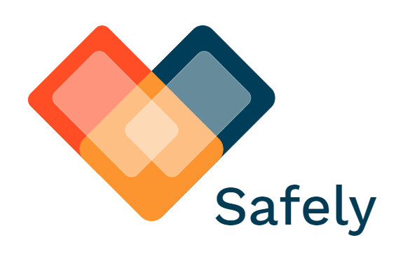

#### _Safely_ is a social-based pandemic monitoring application which tracks the spreading of deceases on a neighborhood scale.

# Features
- Allows users to report their own condition, be it healthy, symptomatic, diagnosed or recovered. Their health status can always be updated.
- Map indicating regions where symptomatic and diagnosed people are located. This allows users to see what areas around them are at high risk for contagion.

# Usage
First, the user must sign in, and if he doesn't already have an account, he must register on the application.  

  

Once the user has correctly entered his/her credentials, he/she will land on a status page, where he/she will be asked about his/her health status.    

  
The answer given will be stored in the database, and the user will be directed toward the map, which is the principal feature of the application. The map shows the area in which there are people that are either symptomatic, or diagnosed with COVID-19.

# Installation
To install this mobile application, you can clone this repository on your local computer, and connect your android phone to your computer. The iOS version has not yet been released on the App Store. If you want to try this app without an android, once the repository is cloned, [download an android emulator](https://visualstudio.microsoft.com/vs/msft-android-emulator/) from Visual Studio's extensions and run the project from VS itself.

# Team
| Y. Demers | W. Laplante | F. Schmitt  | L. Weishaupt  |
| :---:     | :-:         | :-:         | :-:           |
| https://github.com/yaeldemers | https://github.com/williamlaplante | https://github.com/fynnsu | https://github.com/luca-weishaupt |

## Disclaimer 
(i) _Safely_ hasn't been released publically yet. It is still in alpha stage and needs improvements on many fronts before it is commercially available. Any distribution of _Safely_ - done without the development team's approval - might lead to legal actions.

(ii) The development team of _Safely_ and each of its individuals will not, under any circomstances, use the data provided by its users for any reasons but the operation of said-application.

(iii) By utilising _Safely_ you give us permission to use your geo-location data aswell as your health status for the monitoring of the decease (in this case _COVID 19_). By utilising _Safely_ you also accept to not press charge against our development team and each of its individuals regarding the usage of your data, unless it is used for any reasons other than the operation of said-application.
